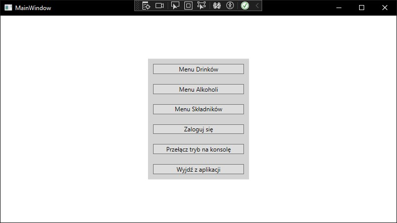
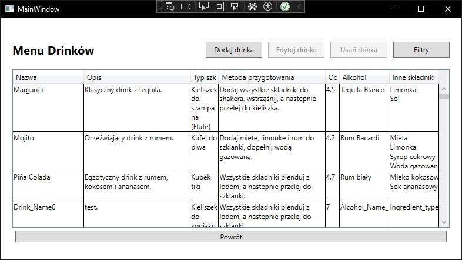
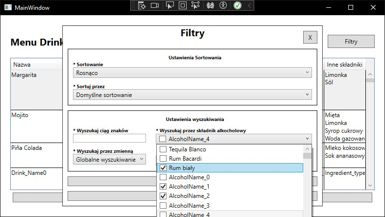
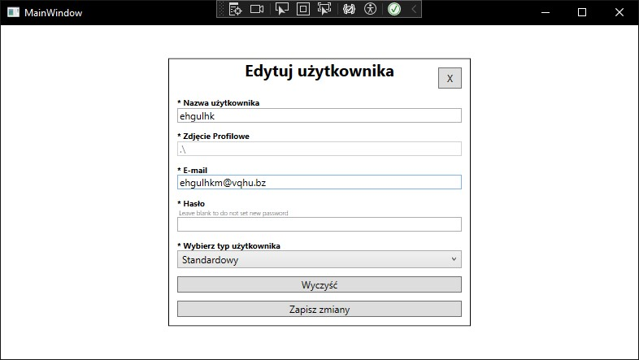
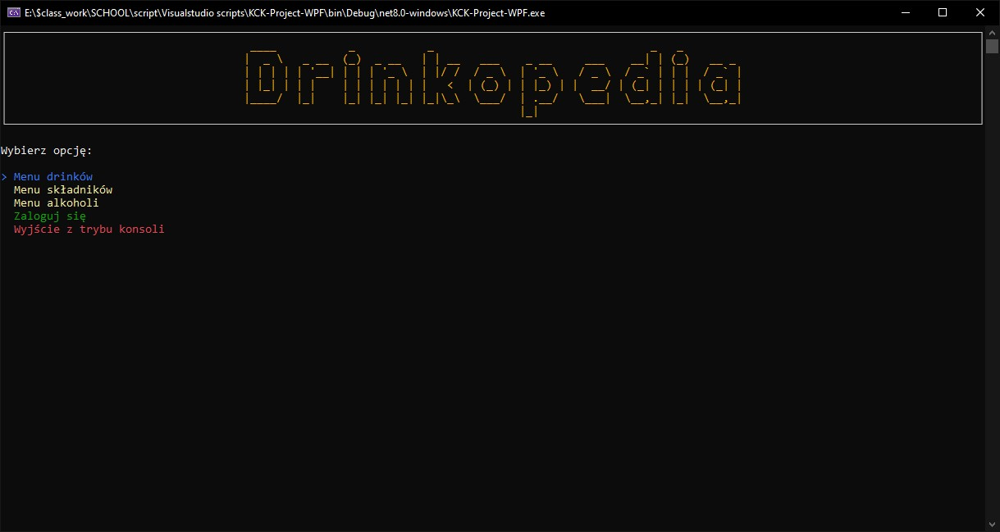

# Drink Management and Tutorial Application

A hybrid application combining WPF and Console interfaces that share well-designed ViewModels under the MVVM architecture. This tool is designed for drink enthusiasts to create, manage, and rate cocktails, with user access control based on roles: User, Moderator, and Administrator.

## Key Features

### 1. User Authentication and Roles

* **User accounts with roles**: User, Moderator, Administrator.
* **Role-based access control**:

  * *User*: Add drinks, ingredients, and related data.
  * *Moderator*: Manage drinks and related data (edit/delete).
  * *Administrator*: Full control, including user management.

### 2. Drink Management

* Add new drinks with detailed recipes.
* Edit and delete existing drinks (depending on role).
* Manage ingredients and quantities.
* Search and filter drinks by available ingredients.

### 3. Tutorials and Ratings

* Users can create and share cocktail tutorials.
* Rating system for tutorials and drinks.
* Ability to select ingredients you have at home to find suitable recipes.

### 4. Hybrid UI Approach

* **WPF Interface**: Rich graphical UI for comfortable interaction.
* **Console Interface**: Lightweight alternative for quick operations.
* Both interfaces use shared ViewModels ensuring consistent business logic and data integrity.

### 5. MVVM Architecture

* Clean separation of concerns with ViewModels shared across both UI layers.
* Easy to maintain and extend.
* Supports command patterns and data binding.

### 6. User Management (Admin only)

* Create, edit, and delete user accounts.
* Assign and change roles.

## Screenshots and UI Preview

### 🏠 Main WPF View

---

### 🥂 Drink List View

---

### ✍️ Filter By Ingredients

---

### ⚙️ User Management View (Admin)

---

### 💻 Console Interface

---

## Technologies Used

* **C#**
* **WPF (.NET 8.0)** for GUI
* **Console Application** for CLI interface
* **MVVM pattern** for architecture

## Roles and Permissions

| Role          | View Drinks and other | Add Drinks | Manage Drinks | Manage Users |
| ------------- | --------------------  | ---------- | ------------- | ------------ |
| User          | ✔️                   |            |               |              |
| Moderator     | ✔️                   | ✔️         |               |              |
| Administrator | ✔️                   | ✔️         | ✔️            | ✔️           |
